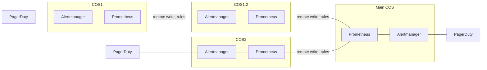

## Integrating Prometheus Charmed Operator

Prometheus Charmed Operator integrates with the following:

1. Any charm that supports the `prometheus_scrape` interface in
serving as a scrape target for Prometheus. This integration is done
using the Prometheus Charm library. The documentation of the charm
library, available through
[Charmhub](https://charmhub.io/prometheus-k8s/libraries). A scrape
target charm provides the Prometheus charm information necessary to
construct scrape configurations for the target. This information
exchanged through the `prometheus_scrape` interface can be broken down
into three parts

- A scrape job specification that includes host addresses, ports and
  paths of one or more [OpenMetrics](https://openmetrics.io/)
  endpoints.  A scrape job specification may also include labels that
  annotate metrics obtained from that endpoint. The Prometheus charm
  will however ensure that all metrics do have labels that indicate
  the source of metrics and alerts, within the Juju charm ecosystem.

- Scrape metadata that is used by the Prometheus charm to add labels
  to all metrics and alerts.

- Alert rules which that tell Prometheus when to raise alerts. This
  rules are read from a directory named `prometheus_alert_rules`, if
  present at the top level, within the scrape target charm's source
  (`src`) folder.

Any time new relations are made, or existing ones changed, between the
Prometheus charm and any scrape target charm, a new Prometheus
configuration is generated.

2. [Grafana Charmed Operator](https://charmhub.io/grafana-k8s), over the `grafana_datasource` interface, to provide a dashboard for viewing metrics aggregated by Prometheus. These dashboards may be customised by charms that relate to Grafana.

3. [Alertmanager Charmed Operator](https://charmhub.io/alertmanager-k8s), over the `alertmanager` interface, so Prometheus may forward alerts to it.

4. [Traefik Charmed Operator](https://charmhub.io/traefik-k8s), over the `ingress_per_unit` interface, so Prometheus may be reached from outside the Kubernetes cluster it is running on.

5. [Catalogue Charmed Operator](https://charmhub.io/catalogue-k8s), over the `catalogue` interface, so Prometheus can be published in the service catalogue web page.

## Deployment scenarios

### Tier prometheus deployments (local-remote on-call teams)

Main COS will have a combination of rules COS1+COS2+Main COS to track the health of the entire system.
Prometheus in COS1 scrapes an application (PagerDuty), sends metrics and alert rules to Prometheus in COS1.2, 
which sends metrics and alert rules to Prometheus in Main COS. As result Prometheus in Main COS will have alert rules
defined in the application.
